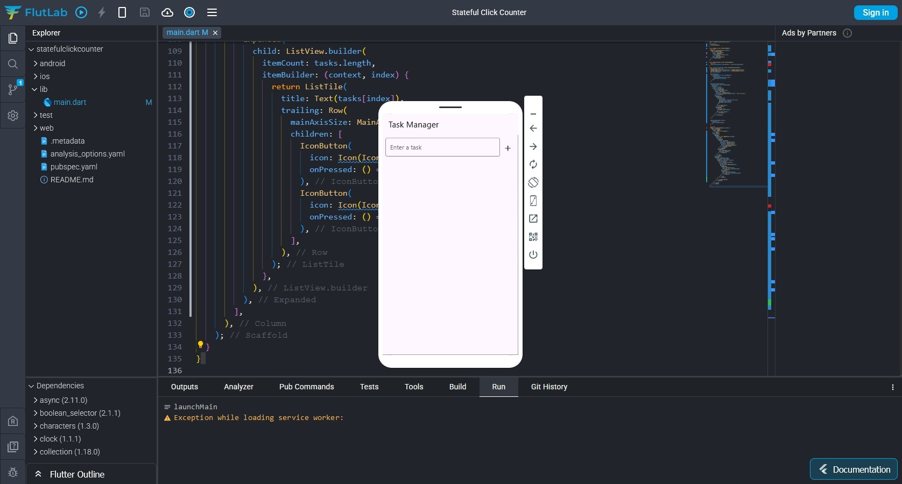
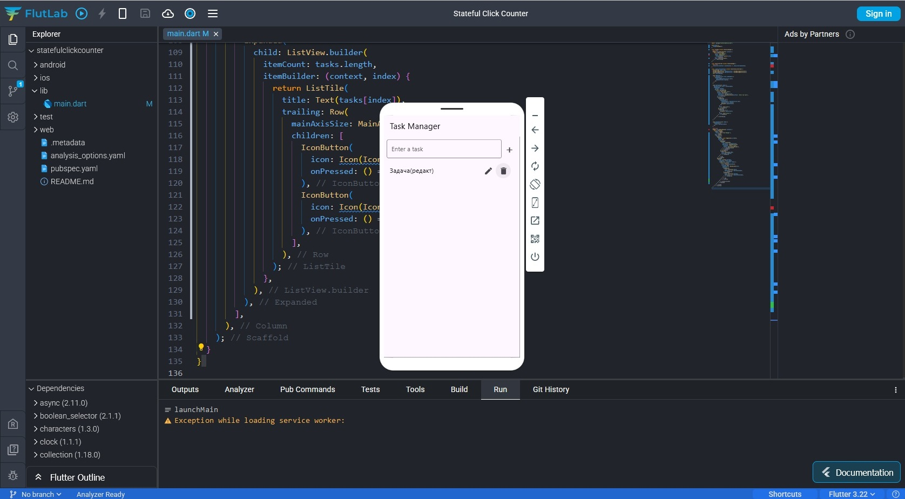

# Task Manager Flutter App

Простое мобильное приложение для управления задачами, созданное с использованием **Flutter** и **Dart**. Пользователь может добавлять, редактировать и удалять задачи.

## 📸 Скриншоты

| Добавление задачи | Редактирование задачи | Удаление задачи |
|-------------------|-----------------------|-----------------|
|  |  |  |

## 🚀 Возможности

- **Добавление задачи**: Пользователь может ввести задачу в текстовое поле и добавить её в список.
- **Редактирование задачи**: Пользователь может изменить текст выбранной задачи.
- **Удаление задачи**: Пользователь может удалить задачу из списка.
- **Отображение задач**: Список задач отображается с помощью `ListView.builder`.

## 🛠️ Технологии

- **Flutter**: Фреймворк для создания кроссплатформенных приложений.
- **Dart**: Язык программирования, используемый в Flutter.
- **StatefulWidget**: Для управления состоянием приложения.

## 📁 Структура проекта
- **task_app/**
  - **assets/** - Папка для изображений и других ресурсов.
  - **canvaskit/** - Файлы для рендеринга CanvasKit.
  - **screenshots/** - Скриншоты с демонстрацией экрана.
  - **icons/** - Иконки приложения.
  - **.last_build_id** - Файл для отслеживания последней сборки.
  - **README.md** - Этот файл.
  - **favicon.png** - Иконка для веб-приложения.
  - **flutter.js** - Скрипт для запуска Flutter в вебе.
  - **flutter_bootstrap.js** - Скрипт для инициализации Flutter.
  - **flutter_service_worker.js** - Сервис-воркер для оффлайн-работы.
  - **index.html** - Основной HTML-файл для веб-приложения.
  - **main.dart.js** - Скомпилированный JavaScript-код Dart.
  - **manifest.json** - Манифест для PWA (Progressive Web App).
  - **version.json** - Файл с информацией о версии.
